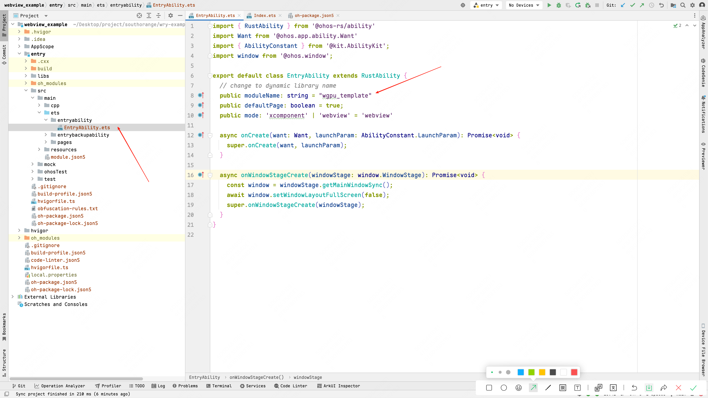

# How to run those examples in an emulator?

This document will tell you that how to run those examples in an emulator.There are serval steps need to do.

## Install DevEco Studio

At first, we need to download DevEco Studio, you can get it with [Download Url](https://developer.huawei.com/consumer/en/download/).

**Note: It must register and login huawei account at first.**


## Setup rust and environment

Then we need to install rust toolchains and setup some environments.

1. Rust Version >= 1.80.0
2. Setup environment.
   ```bash
   # Mac
   export OHOS_NDK_HOME=/Applications/DevEco-Studio.app/Contents/sdk/default/openharmony
   ```
3. Install build tool.
   ```bash
   cargo install ohrs
   rustup target add aarch64-unknown-linux-ohos
   ```

## Setup emulator

When you already install DevEco Studio, you can find the following content in pic.


Then click the `New Emulator` button.


Select or download image that you want to create, i recommend you select or download `5.0.0(12)`.


Finish setups.


## Build project

Use ohrs to build the rust examples which are in `examples`.

```bash
# Build arm64-v8a target
cd examples/basic && ohrs build --arch aarch
```

## Run

At first, using DecEco Studio to open the `webview_example` folder.


Then start the emulator which created at previous.


Copy the dynamic library to example.

```bash
cp -r ./examples/basic/dist/ ./webview_example/entry/libs
```

Change the following code to your dynamic library name which is in `entry/src/main/ets/entryability/EntryAbility.ets`:



For example, if you run basic example and you can change it to `wry_example` and click run.

